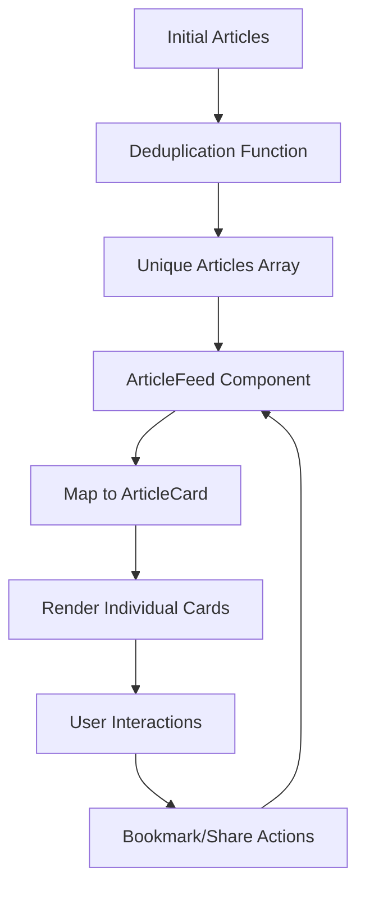

# Design Document

## Overview

This design document outlines the UI redesign of the AI News App to match the professional editorial style of Reuters' Artificial Intelligence section. The redesign focuses on creating a premium, clean news reading experience with large hero images, sophisticated typography, and strict image deduplication while maintaining the vertical "shorts style" mobile experience.

The design follows these core principles:
- **Editorial Quality**: Professional news layout matching Reuters' visual standards
- **Image Uniqueness**: Strict deduplication to prevent any duplicate images
- **Responsive Design**: Mobile-first shorts style that adapts to desktop editorial grid
- **Performance**: Optimized loading with skeleton states and lazy loading
- **Accessibility**: Semantic HTML and ARIA labels for screen readers

## Architecture

### Component Structure

```
ArticleFeed (Container)
├── Deduplication Logic
├── Bookmark State Management
├── Share/Collection Modals
└── Article Grid/List
    ├── ArticleCard (Repeating)
    │   ├── Hero Image (3:2 aspect ratio)
    │   ├── Category Badge
    │   ├── Meta Information
    │   ├── Headline
    │   ├── Summary (line-clamped)
    │   └── Action Bar
    └── ArticleCardSkeleton (Loading State)
```

### Data Flow



## Components and Interfaces

### 1. ArticleFeed Component

**Purpose**: Container component that manages article data, deduplication, and user interactions

**Key Features**:
- Article deduplication by image URL
- Bookmark state management
- Responsive grid layout (1 column mobile, 2 columns desktop)
- Share and collection modal handling
- Load more pagination

**Deduplication Logic**:
```typescript
function deduplicateArticles(articles: Article[]): Article[] {
  const seenImages = new Set<string>()
  return articles.filter(article => {
    const imageUrl = article.image_url || 'fallback'
    if (seenImages.has(imageUrl)) {
      return false
    }
    seenImages.add(imageUrl)
    return true
  })
}
```

**Layout Structure**:
- Container: max-width 900px (Reuters-style)
- Mobile: Single column vertical feed
- Desktop: 2-column grid with gap-8
- Centered layout with proper padding

**Design Rationale**:
- Deduplication at feed level ensures no duplicate images render
- Set-based tracking provides O(1) lookup performance
- Responsive grid maintains shorts style on mobile while utilizing desktop space

### 2. ArticleCard Component

**Purpose**: Individual article card with Reuters-inspired editorial design

**Visual Hierarchy**:
1. **Standard Image** (Top, 16:9 aspect ratio)
   - Standard height: 200-250px
   - Hover scale effect (1.05x)
   - Fixed aspect ratio prevents layout shift
   - Object-cover ensures proper cropping

2. **Category Badge** (Above headline)
   - Dark background (slate-900)
   - White text, uppercase, bold
   - Small, compact design

3. **Meta Information** (Below category)
   - Source name
   - Published date (relative time)
   - Muted gray text (slate-500)
   - Separated by bullet points

4. **Headline** (Primary focus)
   - Standard: 18px (text-lg) on mobile, 20px (text-xl) on desktop
   - Bold font-weight (700)
   - Dark text (slate-900)
   - Hover effect for interactivity
   - Leading-tight for compact multi-line headlines

5. **Summary** (Supporting text)
   - 14px text size (text-sm)
   - Line-clamp-2 (max 2 lines)
   - Medium gray (slate-700)
   - Leading-relaxed for readability

6. **Action Bar** (Bottom)
   - "Read more" link (left)
   - Bookmark and share buttons (right)
   - Icon-based actions with hover states

**Image Handling**:
```typescript
const FALLBACK_IMAGE = 'https://images.unsplash.com/photo-1677442136019-21780ecad995?w=1200&h=800&fit=crop'

const finalImageUrl = imageError || !article.image_url 
  ? FALLBACK_IMAGE 
  : article.image_url
```

**Design Rationale**:
- Single image selection prevents any duplicate rendering
- 3:2 aspect ratio matches editorial photography standards
- Fixed-height container prevents cumulative layout shift
- Fallback ensures every card has an image

### 3. ArticleCardSkeleton Component

**Purpose**: Loading placeholder that matches ArticleCard structure

**Structure**:
- Image skeleton (3:2 aspect ratio, gradient background)
- Category badge skeleton
- Meta information skeleton (2 bars)
- Headline skeleton (2 lines, varying widths)
- Summary skeleton (3 lines)
- Action bar skeleton

**Animation**:
- Pulse animation (animate-pulse)
- Gradient backgrounds (slate-200 to slate-300)
- Matches exact spacing of real card

**Design Rationale**:
- Matching structure prevents layout shift when content loads
- Pulse animation provides loading feedback
- Gradient creates subtle visual interest

## Data Models

### Article Type

```typescript
interface Article {
  id: number
  title: string
  summary: string
  category: string | null
  source: string | null
  url: string | null
  image_url: string | null
  published_at: string
  created_at: string
}
```

### Component Props

```typescript
interface ArticleCardProps {
  article: Article
  isBookmarked: boolean
  onBookmark: (articleId: number) => Promise<void>
  onShare: (article: Article) => void
}

interface ArticleFeedProps {
  initialArticles: Article[]
  userId?: string
  currentPage: number
  category?: string
  searchQuery?: string
}
```

## Visual Design Specifications

### Color Palette (Reuters-Inspired)

**Light Mode**:
- Background: white (#ffffff)
- Primary Text: slate-900 (#0f172a)
- Secondary Text: slate-700 (#334155)
- Muted Text: slate-500 (#64748b)
- Borders: slate-200 (#e2e8f0)
- Category Badge: slate-900 (#0f172a)
- Hover: slate-700 (#334155)

**Dark Mode**:
- Background: slate-900 (#0f172a)
- Primary Text: white (#ffffff)
- Secondary Text: slate-300 (#cbd5e1)
- Muted Text: slate-400 (#94a3b8)
- Borders: slate-800 (#1e293b)
- Category Badge: slate-700 (#334155)

### Typography

**Font Stack**:
- Headlines: System font stack (sans-serif)
- Body: System font stack (sans-serif)
- Monospace: For code/technical content

**Font Sizes**:
- Category: 11px (text-xs)
- Meta: 12px (text-xs)
- Summary: 14px (text-sm)
- Headline Mobile: 18px (text-lg)
- Headline Desktop: 20px (text-xl)

**Font Weights**:
- Category: 600 (semibold)
- Meta: 500 (medium)
- Headline: 700 (bold)
- Summary: 400 (normal)

**Line Heights**:
- Headline: leading-tight (1.25)
- Summary: leading-relaxed (1.625)
- Meta: leading-normal (1.5)

### Spacing

**Card Spacing**:
- Padding: 0 (image full-bleed)
- Content padding: 20px (p-5) mobile, 24px (p-6) desktop
- Gap between elements: 12px (space-y-3)
- Grid gap: 32px (gap-8)

**Container**:
- Max width: 900px
- Horizontal padding: 16px (px-4) mobile, 24px (px-6) desktop

### Responsive Breakpoints

- Mobile: < 768px (single column)
- Desktop: ≥ 768px (2-column grid)
- Large Desktop: ≥ 1280px (maintain 2 columns, increase spacing)

## User Experience Enhancements

### Hover Effects

**ArticleCard**:
- Image: scale(1.05) with 500ms transition
- Headline: Color change to slate-700
- Action buttons: Background color change (slate-100)

**Transitions**:
```css
transition-transform duration-500
transition-colors
```

### Loading States

**Initial Load**:
- Show 6 ArticleCardSkeleton components
- Pulse animation for visual feedback
- Match exact card structure

**Image Loading**:
- Fixed-height container prevents shift
- Lazy loading for performance
- Error handling with fallback image

### Scroll Behavior

**Mobile (Shorts Style)**:
- Vertical scroll
- Full-width cards
- Smooth scrolling
- Infinite scroll ready

**Desktop**:
- 2-column grid
- Maintains vertical scroll
- Cards aligned in grid

## Error Handling

### Image Loading Errors

**Scenario**: Image URL fails to load

**Handling**:
```typescript
const [imageError, setImageError] = useState(false)

<Image
  onError={() => setImageError(true)}
  src={imageError ? FALLBACK_IMAGE : article.image_url}
/>
```

**Result**: Fallback image displays seamlessly

### Missing Data

**Scenario**: Article missing category, source, or image

**Handling**:
- Category: Default to 'AI'
- Source: Default to 'AI News'
- Image: Use FALLBACK_IMAGE
- Summary: Show empty state if missing

### Bookmark Errors

**Scenario**: User not authenticated or API failure

**Handling**:
- Show toast notification
- Revert optimistic UI update
- Provide clear error message

## Performance Optimizations

### Image Optimization

1. **Next.js Image Component**:
   - Automatic WebP conversion
   - Responsive srcset generation
   - Lazy loading by default
   - Quality: 85 (balance size/quality)

2. **Sizes Attribute**:
   ```typescript
   sizes="(max-width: 768px) 100vw, (max-width: 1200px) 50vw, 600px"
   ```

3. **Priority Loading**:
   - First 2-3 cards: priority={true}
   - Rest: priority={false} (lazy load)

### Deduplication Performance

- Set-based lookup: O(1) complexity
- Single pass through articles array
- Minimal memory overhead

### Rendering Optimization

- Key prop: `article-${article.id}` for stable identity
- Memoization candidates: ArticleCard (if needed)
- Avoid inline function definitions in map

## Accessibility

### Semantic HTML

```html
<article> - Card wrapper
<h2> - Headline
<time> - Published date
<button> - Interactive elements
 - Descriptive alt text
```

### ARIA Labels

```typescript
aria-label={isBookmarked ? 'Remove bookmark' : 'Bookmark article'}
aria-label="Share article"
```

### Keyboard Navigation

- All interactive elements focusable
- Visible focus indicators
- Logical tab order

### Screen Reader Support

- Descriptive link text ("Read more" with context)
- Status announcements for bookmarks
- Proper heading hierarchy

## Testing Strategy

### Visual Regression Tests

1. **Card Rendering**: Verify layout matches design
2. **Responsive Breakpoints**: Test mobile and desktop layouts
3. **Dark Mode**: Ensure proper color contrast
4. **Hover States**: Verify all interactive feedback

### Functional Tests

1. **Deduplication**: Verify no duplicate images render
2. **Bookmark Toggle**: Test add/remove functionality
3. **Share Modal**: Verify modal opens with correct data
4. **Image Fallback**: Test error handling

### Performance Tests

1. **Image Loading**: Measure LCP (Largest Contentful Paint)
2. **Scroll Performance**: Test smooth scrolling with many cards
3. **Memory Usage**: Monitor for leaks during pagination

### Accessibility Tests

1. **Keyboard Navigation**: Tab through all interactive elements
2. **Screen Reader**: Test with NVDA/JAWS
3. **Color Contrast**: Verify WCAG AA compliance
4. **Focus Indicators**: Ensure visibility

## Implementation Notes

### Migration from Current Design

**Changes Required**:
1. Remove rounded corners from cards (border-b instead)
2. Increase headline font size (text-2xl → text-3xl)
3. Change image aspect ratio (16:9 → 3:2)
4. Update color palette to neutral tones
5. Simplify category badge design
6. Add deduplication logic to ArticleFeed

**Backward Compatibility**:
- Maintain existing props interface
- Keep bookmark and share functionality
- Preserve dark mode support

### Code Organization

```
components/article/
├── ArticleCard.tsx (Redesigned)
├── ArticleFeed.tsx (Add deduplication)
├── ArticleCardSkeleton.tsx (Update structure)
└── utils/
    └── deduplication.ts (New utility)
```

### Styling Approach

- Pure TailwindCSS (no custom CSS)
- Utility-first classes
- Responsive modifiers (sm:, md:, lg:)
- Dark mode variants (dark:)

## Deployment Considerations

### Browser Support

- Modern browsers (Chrome, Firefox, Safari, Edge)
- CSS Grid support required
- Next.js Image component compatibility

### Performance Targets

- LCP: < 2.5s
- FID: < 100ms
- CLS: < 0.1
- Image load: < 1s on 3G

### Monitoring

- Track image load failures
- Monitor deduplication effectiveness
- Measure user engagement (clicks, bookmarks)
- A/B test new design vs old

